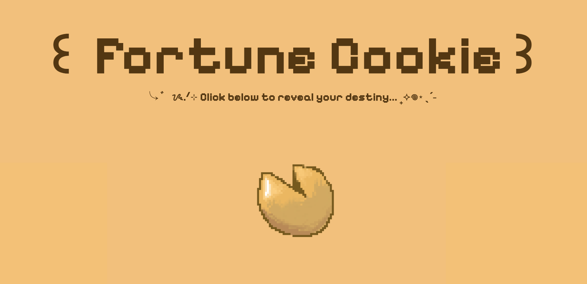

# This project is called Fortune Cookie! 

### What my project is/does:
> The fortune cookie scales up when the user hovers, and makes a popping sound when clicked.
> The site uses a pixel theme with a custom cursor, and soft colors to give it a cozy vibe.
> Here's a screenshot!
>
> 
>
### How you can view my project
> Click here: https://zarazahed.github.io/quote-site/
> 
### Why I made my project:
> I thought it'd be fun to make so I could use it whenever I wanted some random wisdom :)
> It helped me review some CSS and JS concepts I learned on my last few projects
> 
### How I made my project
> I used HTML, CSS, JavaScript to make the site!

### What I struggled with and what I learned:
> I struggled with deciding on the idea for the website. I really like the fortune cookie one that I chose.
> I had trouble finding a pixel art website and navigating it to draw the cookie.
> I learned how to draw and export pixel art for free online though!
>
#### Credits
> Quotes inspired by Google, font from Google Fonts, art by me!

